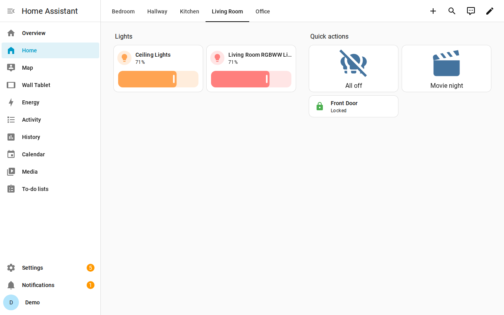
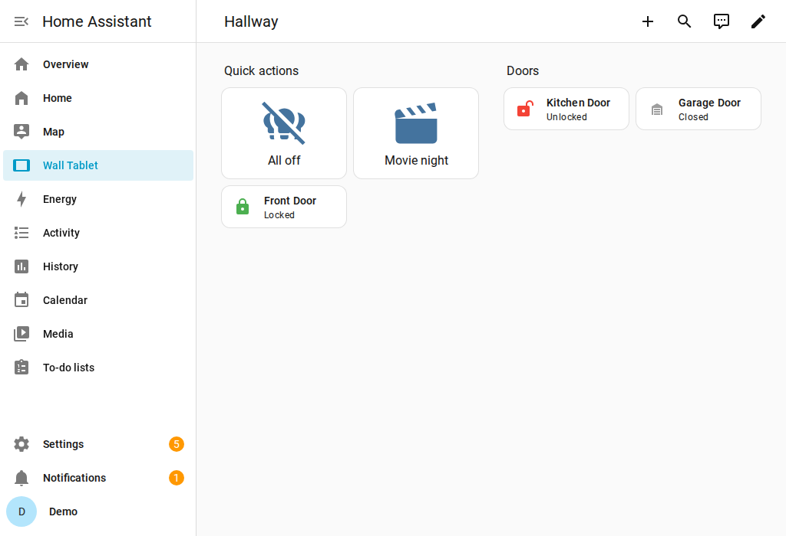

# terraform-provider-homeassistant

An OpenTofu (and Terraform) provider for managing a [Home Assistant](https://www.home-assistant.io/)
instance as code: floors, areas, labels, entity and device settings, automations, scripts,
scenes, helpers, dashboards, and integrations.

## Features

- **Registries:** floors, areas, and labels (`homeassistant_floor`, `homeassistant_area`,
  `homeassistant_label`).
- **Entities and devices an integration owns:** name, icon, area, labels, hidden and disabled,
  managed field by field (`homeassistant_entity_settings`, `homeassistant_device_settings`).
- **Automations, scripts and scenes** (`homeassistant_automation`, `homeassistant_script`,
  `homeassistant_scene`), taking their config as an object, e.g. from `yamldecode(file(...))`.
- **Helpers:** `input_boolean`, `input_number`, `input_text`, `input_select`, `input_datetime`
  and `input_button`, validated at plan time.
- **Dashboards** (`homeassistant_dashboard`).
- **Integrations:** any config entry by answering its config flow
  (`homeassistant_integration`), plus typed resources for ESPHome and MQTT
  (`homeassistant_esphome`, `homeassistant_mqtt`).
- **Data sources** to look things up: entities, devices, areas, integrations, the instance config,
  and rendered templates.
- **Provider functions** that build dashboard cards and sections, and automation triggers,
  conditions and actions.
- Every resource supports `tofu import`.

The [documentation](docs/) covers every resource, data source and function, with examples;
[`CHANGELOG.md`](CHANGELOG.md) lists what changed in each release.

## Demo

[`examples/demo/`](examples/demo/) configures a fresh Home Assistant in Docker with one
`tofu apply`: areas, the same automation for every area from one template, automations from YAML
files, and two dashboards built from the lights in each area, with a shared quick-actions
section.


The recording is [`docs/demo.cast`](docs/demo.cast) (play it with `asciinema play`). The UI edit
in it is the request Home Assistant's automation editor sends on save. The dashboards it builds:

| Home, one view per area | Wall Tablet, sharing the quick actions |
|---|---|
|  |  |

## Installation

The provider is published on the OpenTofu and the Terraform registry as `toelke/homeassistant`.
Create a long-lived access token in Home Assistant (your profile, "Security" tab), then:

```hcl
terraform {
  required_providers {
    homeassistant = {
      source  = "toelke/homeassistant"
      version = "= 0.1.0"
    }
  }
}

provider "homeassistant" {
  url   = "http://homeassistant.local:8123"
  token = var.ha_token # long-lived access token
}
```

`url` and `token` can also come from `HOMEASSISTANT_URL` and `HOMEASSISTANT_TOKEN`.

## Stability

Until v1.0, the provider is not stable. Any minor release (`0.x`) may contain breaking changes to
resources, attributes or state. Every breaking change is listed under **Breaking** in
[`CHANGELOG.md`](CHANGELOG.md). Pin an exact version (`version = "= 0.1.0"`) and read the
changelog before you upgrade.

## Development

```sh
go test -short ./...   # unit tests
go generate ./...      # regenerate docs/ from schema, examples/ and templates/
```

Install the hooks once with `pre-commit install`. They run gofumpt, `go mod tidy`, golangci-lint,
the unit tests and the docs check; CI runs the same hooks (`pre-commit run --all-files`).

### Acceptance tests

Acceptance tests run the provider with OpenTofu against a real Home Assistant in Docker. The
harness in [`internal/acctest`](internal/acctest/) starts one container per test package with
testcontainers-go, onboards it headlessly, and mints a long-lived token. They need Docker and
are skipped without `TF_ACC`:

```sh
TF_ACC=1 TF_ACC_TERRAFORM_PATH="$(which tofu)" \
  TF_ACC_PROVIDER_NAMESPACE=toelke TF_ACC_PROVIDER_HOST=registry.opentofu.org \
  HOMEASSISTANT_IMAGE_TAG=2026.9.4 \
  go test -run '^TestAcc' ./...
```

`HOMEASSISTANT_IMAGE_TAG` is optional and defaults to the newest version in the CI matrix.

#### Bumping the Home Assistant versions

CI tests the oldest and the newest of the six most recent monthly HA releases
([ADR-0003](adr/0003-home-assistant-support-window.md)). When a new monthly release is out:

1. In [`.github/workflows/acceptance.yml`](.github/workflows/acceptance.yml), set the `ha` matrix
   to the latest patch release of the newest month and of the month five releases before it,
   e.g. `2026.4.4` and `2026.9.4`. Tags are listed at
   <https://github.com/home-assistant/core/releases>.
2. Set `DefaultImageTag` in [`internal/acctest/acctest.go`](internal/acctest/acctest.go) to the
   newest tag.

### Local builds

To try a local build with OpenTofu, install it into a plugin directory and point `tofu init` at
it:

```sh
dir=/tmp/tofu-plugins/registry.opentofu.org/toelke/homeassistant/0.0.1/$(go env GOOS)_$(go env GOARCH)
mkdir -p "$dir" && go build -o "$dir/terraform-provider-homeassistant_v0.0.1" .
tofu init -plugin-dir=/tmp/tofu-plugins
```

Alternatively, use a `dev_overrides` block in your CLI configuration
(`provider_installation { dev_overrides { "toelke/homeassistant" = "<dir of the binary>" } }`)
and skip `tofu init`, as OpenTofu advises.

### Releasing

Pushing a `v*` tag runs [`.github/workflows/release.yml`](.github/workflows/release.yml).
GoReleaser ([`.goreleaser.yml`](.goreleaser.yml)) builds the zips, writes `SHA256SUMS` and the
registry manifest, signs the checksums with GPG, and publishes a GitHub release. Both registries
pick it up from there.

1. Move the `Unreleased` entries in `CHANGELOG.md` under the new version, and merge that.
2. `git tag vX.Y.Z origin/main && git push origin vX.Y.Z`.

Before the first release, these steps are needed once:

1. Create a signing key without an expiry that needs renewal. Use RSA or DSA, because the
   Terraform registry does not accept ECC keys:
   `gpg --quick-gen-key "terraform-provider-homeassistant <you@example.org>" rsa4096 sign never`.
2. Store it as repository secrets: `gpg --armor --export-secret-keys <FPR> | gh secret set
   GPG_PRIVATE_KEY`, and the passphrase with `gh secret set PASSPHRASE`.
3. Add the public key (`gpg --armor --export <FPR>`) to the Terraform registry (namespace
   settings, "Signing Keys"), then publish the provider there from the GitHub repository.
4. For OpenTofu, open a "Submit new provider" issue and a "Submit new signing key" issue (the
   public key) at <https://github.com/opentofu/registry/issues/new/choose>.

## Repository layout

| Path | Content |
|---|---|
| [`GLOSSARY.md`](GLOSSARY.md) | Domain vocabulary — Home Assistant and provider terms |
| [`adr/`](adr/) | Architecture decision records — *why* things are the way they are |
| [`spec/`](spec/) | Specification — *what* the provider does, per resource family |
| [`tickets/`](tickets/) | Implementation plan as vertical slices, in rough order |

## How this project is built

All code and documentation in this repository is generated by
[Claude Code](https://claude.com/claude-code) (Anthropic's Claude), directed and reviewed by a
human maintainer.

The design was worked out with [Matt Pocock's agent skills](https://www.aihero.dev/skills) — in
particular *grilling* (relentless design-tree interviews that produced the ADRs) and
*domain-modeling* (glossary and ADR discipline).

## License

[MPL-2.0](https://www.mozilla.org/en-US/MPL/2.0/)
